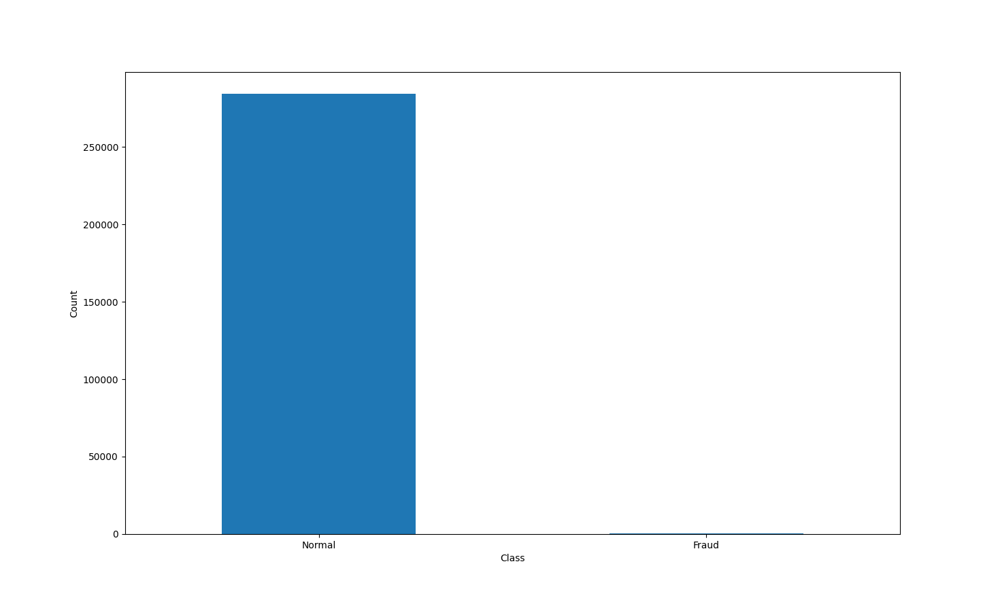
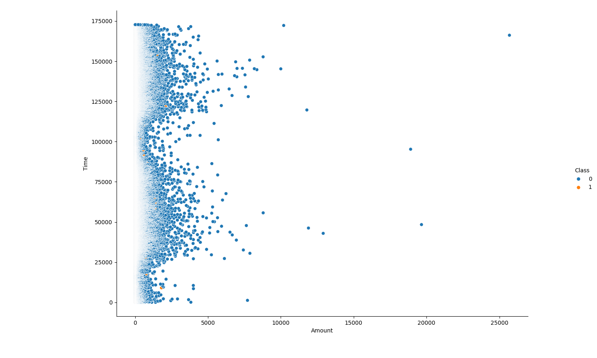

# 🛡️ Credit Card Fraud Detection

A machine learning model built to detect fraudulent credit card transactions using logistic regression. The model is trained and evaluated on a labeled dataset with performance metrics including accuracy, precision, recall, and F1-score.

---

## 📊 Project Overview

- Developed using Python (scikit-learn, pandas, matplotlib, seaborn)
- Evaluated using key classification metrics
- Visualized fraud and non-fraud patterns using plots
- Achieved strong performance across training and test sets

---

## 📂 Dataset

The dataset used is from [Kaggle - Credit Card Fraud Detection](https://www.kaggle.com/datasets/mlg-ulb/creditcardfraud).  
> Note: The dataset is not included in this repository due to size limits.

---
## 📈 Visualizations

### 📊 Class Distribution (Normal vs Fraud)
Shows the imbalance between normal and fraudulent transactions.


---

### 🔍 Amount vs Time (Color-Coded by Class)
Displays transaction amount over time, colored by fraud class.


---


## 🔧 Techniques Used

- Logistic Regression
- Stratified Train-Test Split
- Accuracy, Precision, Recall, F1-Score
- Confusion Matrix
- Seaborn Relational Plotting

---

## ⚙️ How to Run

### 1. Clone the repository
```bash
git clone https://github.com/nithun-rajan/Credit-Card-Fraud-Detection.git
cd Credit-Card-Fraud-Detection

